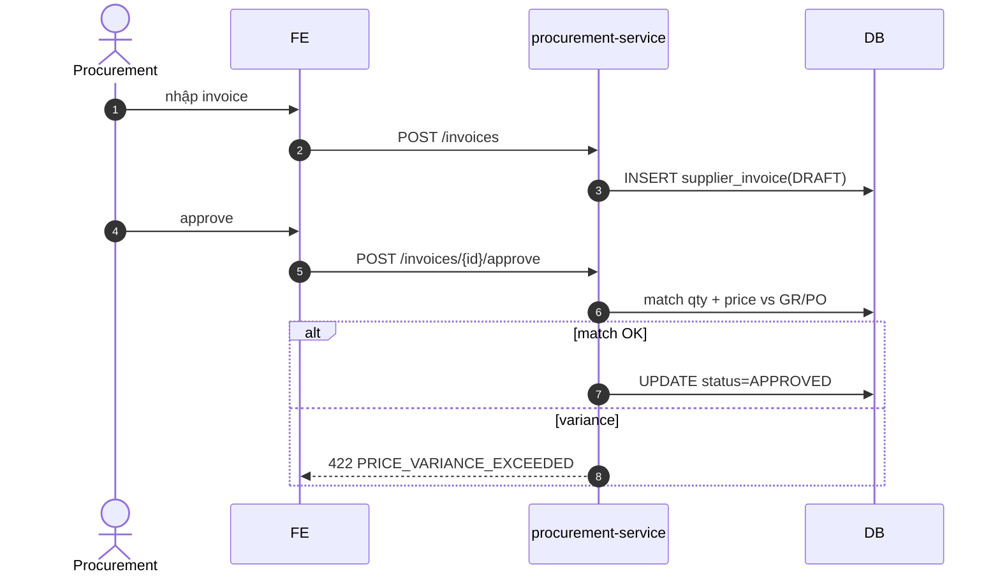

# UC-PROC-003: Hoá đơn NCC (three-way match)

**Module:** Thu mua
**Mô tả ngắn:** Nhập hóa đơn từ NCC, đối chiếu PO + GR + Invoice (three-way match) trước khi duyệt; invoice `APPROVED` mới cho phép thanh toán.
**Phiên bản SRS:** 1.0
**Source code tham chiếu:**

- Backend: [SupplierInvoiceController.java](../../services/procurement-service/src/main/java/com/fern/services/procurement/api/SupplierInvoiceController.java)
- Frontend: [ProcurementModule.tsx](../../frontend/src/components/procurement/ProcurementModule.tsx)

## 1. Actors & quyền

| Actor | Role | Permission |
|-------|------|------------|
| Procurement | `procurement_officer` | `purchase.write` |
| Finance | `finance` | `finance.write` (approve) |
| Outlet Manager | `outlet_manager` | `purchase.approve` |

## 2. Điều kiện

- **Tiền điều kiện:** Có ≥1 GR `POSTED` khớp supplier/PO; invoice lines chưa được match sang invoice khác.
- **Hậu điều kiện (thành công):** `supplier_invoice` `APPROVED`, sẵn sàng cho `supplier_payment`.
- **Hậu điều kiện (thất bại):** Invoice giữ `DRAFT`/`REJECTED`.

## 3. Thực thể dữ liệu

| Entity | Bảng |
|--------|------|
| Supplier Invoice | `supplier_invoice` |
| Invoice Item | `supplier_invoice_item` |
| Goods Receipt | `goods_receipt` |
| Purchase Order | `purchase_order` |

## 4. API endpoints

| Method | Path | Handler |
|--------|------|---------|
| POST | `/api/v1/procurement/invoices` | `SupplierInvoiceController#create` |
| GET  | `/api/v1/procurement/invoices` | `#list` |
| GET  | `/api/v1/procurement/invoices/{id}` | `#get` |
| POST | `/api/v1/procurement/invoices/{id}/approve` | `#approve` |

## 5. Luồng chính (MAIN)

1. Procurement nhập invoice: `{ supplierId, invoiceNo, invoiceDate, currency, lines: [{goodsReceiptItemId, qty, unitPrice, taxRate}] }`.
2. FE gọi `POST /invoices` → `DRAFT`.
3. Actor bấm approve → `POST /invoices/{id}/approve`.
4. Service chạy three-way match:
   - Mỗi line → tìm `goods_receipt_item` tương ứng.
   - Check `qty ≤ goods_receipt_item.received_qty` và chưa allocate sang invoice khác.
   - Check `unitPrice` chênh so với `purchase_order_item.unit_cost` ≤ `PRICE_TOLERANCE` (mặc định 2%).
5. Match OK → `APPROVED`, ghi `supplier_invoice_item.matched_gr_item_id`.
6. Event `procurement.invoice.approved`.

## 6. Luồng thay thế / lỗi

- **ALT-1 Partial invoice** — 1 GR nhiều invoice → chia qty theo lines; phần còn lại chờ invoice sau.
- **EXC-1 Qty mismatch** → `422 INVOICE_QTY_EXCEEDS_GR`.
- **EXC-2 Price variance vượt tolerance** → `422 PRICE_VARIANCE_EXCEEDED`; cần overrider role `finance`.
- **EXC-3 Invoice trùng số** (supplier + invoiceNo) → `409 DUPLICATE_INVOICE_NO`.
- **EXC-4 GR chưa POSTED** → `409 GR_NOT_POSTED`.

## 7. Quy tắc nghiệp vụ

- **BR-1** — Mỗi `supplier_invoice_item` reference **đúng 1** `goods_receipt_item`.
- **BR-2** — Tax line ghi riêng, tổng = Σ(unitPrice × qty × taxRate).
- **BR-3** — Currency invoice = currency PO gốc; lệch phải chuyển đổi `exchange_rate`.
- **BR-4** — Invoice `APPROVED` bất biến (trừ reverse bằng credit note — ngoài phạm vi UC này).

## 8. State machine

Xem [STATE-MACHINES.md §3](../STATE-MACHINES.md#3-supplier-invoice).

## 9. Sequence diagram

## 10. Ghi chú liên module

- Payment: UC-FIN-001 (`supplier_payment` + `supplier_payment_allocation`).
- Finance expense: `expense_inventory_purchase` tự động sinh khi invoice approved.
- Audit: `procurement.invoice.*`.
