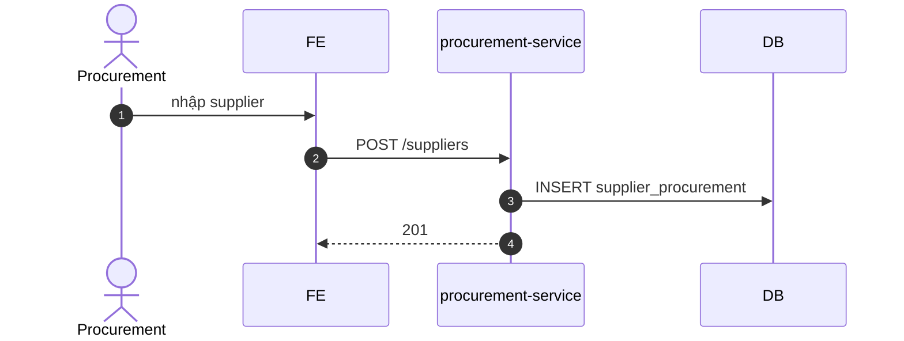

# UC-PROC-004: Quản lý nhà cung cấp

**Module:** Thu mua
**Mô tả ngắn:** CRUD nhà cung cấp, gắn catalog item/giá, quản trị trạng thái active/inactive.
**Phiên bản SRS:** 1.0
**Source code tham chiếu:**

- Backend: [SupplierController.java](../../services/procurement-service/src/main/java/com/fern/services/procurement/api/SupplierController.java)
- Frontend: [ProcurementModule.tsx](../../frontend/src/components/procurement/ProcurementModule.tsx)

## 1. Actors & quyền

| Actor | Role | Permission |
|-------|------|------------|
| Procurement | `procurement_officer` | `purchase.write` |
| Admin | `admin` | (governance) |

## 2. Điều kiện

- **Tiền điều kiện:** Actor có quyền; mã NCC chưa trùng.
- **Hậu điều kiện (thành công):** `supplier_procurement` tạo/cập nhật.
- **Hậu điều kiện (thất bại):** Không thay đổi.

## 3. Thực thể dữ liệu

| Entity | Bảng |
|--------|------|
| Supplier | `supplier_procurement` |

## 4. API endpoints

| Method | Path | Handler |
|--------|------|---------|
| POST | `/api/v1/procurement/suppliers` | `SupplierController#create` |
| GET  | `/api/v1/procurement/suppliers` | `#list` |
| GET  | `/api/v1/procurement/suppliers/{id}` | `#get` |
| PUT  | `/api/v1/procurement/suppliers/{id}` | `#update` |

## 5. Luồng chính (MAIN)

1. Procurement mở tab "Suppliers" → "New".
2. Nhập `{ code, name, taxCode?, currencyCode, contact, address, status }`.
3. FE gọi `POST /suppliers` → 201.
4. Sửa: `PUT /suppliers/{id}` — có thể đổi status `active ↔ inactive`.

## 6. Luồng thay thế / lỗi

- **EXC-1 Trùng code** → `409 SUPPLIER_CODE_DUPLICATE`.
- **EXC-2 Inactive mà còn PO DRAFT** → `409 SUPPLIER_HAS_OPEN_PO` (tùy policy).
- **EXC-3 Thiếu field bắt buộc** → `400`.

## 7. Quy tắc nghiệp vụ

- **BR-1** — `code` unique chuỗi.
- **BR-2** — `currencyCode` phải tồn tại trong `currency`.
- **BR-3** — Inactive supplier không được dùng tạo PO mới.

## 8. Sequence diagram

## 9. Ghi chú liên module

- Audit: `procurement.supplier.created|updated`.
- Org: `currency` thuộc `org-service`.
