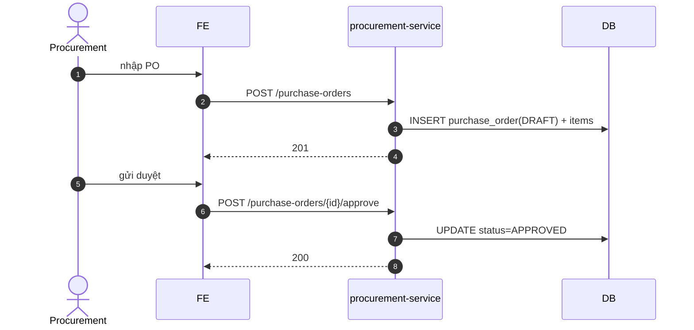

# UC-PROC-001: Tạo đơn mua (PO)

**Module:** Thu mua
**Mô tả ngắn:** Procurement officer lập `purchase_order` gửi nhà cung cấp; quy trình `DRAFT → APPROVED → POSTED → CLOSED`.
**Phiên bản SRS:** 1.0
**Source code tham chiếu:**

- Backend: [PurchaseOrderController.java](../../services/procurement-service/src/main/java/com/fern/services/procurement/api/PurchaseOrderController.java)
- Frontend: [ProcurementModule.tsx](../../frontend/src/components/procurement/ProcurementModule.tsx)

## 1. Actors & quyền

| Actor | Role | Permission |
|-------|------|------------|
| Procurement | `procurement_officer` | `purchase.write` |
| Outlet Manager | `outlet_manager` | `purchase.approve` |
| Region Manager | `region_manager` | `purchase.approve` |

## 2. Điều kiện

- **Tiền điều kiện:** supplier `active`; item trong `purchase_order_item` tồn tại ở catalog; user có scope outlet đích.
- **Hậu điều kiện (thành công):** PO ghi trạng thái tương ứng; event `procurement.po.<state>` phát.
- **Hậu điều kiện (thất bại):** PO không thay đổi state.

## 3. Thực thể dữ liệu

| Entity | Bảng |
|--------|------|
| Purchase Order | `purchase_order` |
| PO Item | `purchase_order_item` |
| Supplier | `supplier_procurement` |

## 4. API endpoints

| Method | Path | Handler |
|--------|------|---------|
| POST | `/api/v1/procurement/purchase-orders` | `PurchaseOrderController#create` |
| GET  | `/api/v1/procurement/purchase-orders` | `#list` |
| GET  | `/api/v1/procurement/purchase-orders/{id}` | `#get` |
| POST | `/api/v1/procurement/purchase-orders/{id}/approve` | `#approve` |

## 5. Luồng chính (MAIN)

1. Procurement chọn supplier + outlet + line items (itemId, qty, unitCost).
2. FE gọi `POST /purchase-orders` → PO `DRAFT`.
3. Manager review → `POST /purchase-orders/{id}/approve` → `APPROVED`.
4. Khi GR post thành công và đủ qty → business job/API chuyển PO sang `POSTED`/`CLOSED` (xem `GoodsReceiptController#post`).

## 6. Luồng thay thế / lỗi

- **ALT-1 Huỷ PO** — DRAFT/APPROVED chưa GR → cancel (qua endpoint riêng hoặc update status nếu có).
- **EXC-1 Supplier inactive** → `409 SUPPLIER_INACTIVE`.
- **EXC-2 Item chưa tồn tại** → `422 ITEM_NOT_FOUND`.
- **EXC-3 Thiếu permission approve** → `403`.
- **EXC-4 Không cùng scope outlet** → `403 SCOPE_DENIED`.

## 7. Quy tắc nghiệp vụ

- **BR-1** — `qty > 0`, `unitCost ≥ 0` cho mỗi line.
- **BR-2** — Currency PO = `supplier.currency_code`; quy đổi sang `outlet.currency_code` qua `exchange_rate` khi xuất báo cáo.
- **BR-3** — Ngưỡng approve (giá trị PO) có thể theo role (region_manager ≥ X).
- **BR-4** — Immutable sau `APPROVED` (không sửa line items, chỉ cancel).

## 8. State machine

Xem [STATE-MACHINES.md §1](../STATE-MACHINES.md#1-purchase-order).

## 9. Sequence diagram

## 10. Ghi chú liên module

- GR (UC-PROC-002) nhận hàng đối chiếu `purchase_order_item.qty`.
- Audit: `procurement.po.created|approved`.
